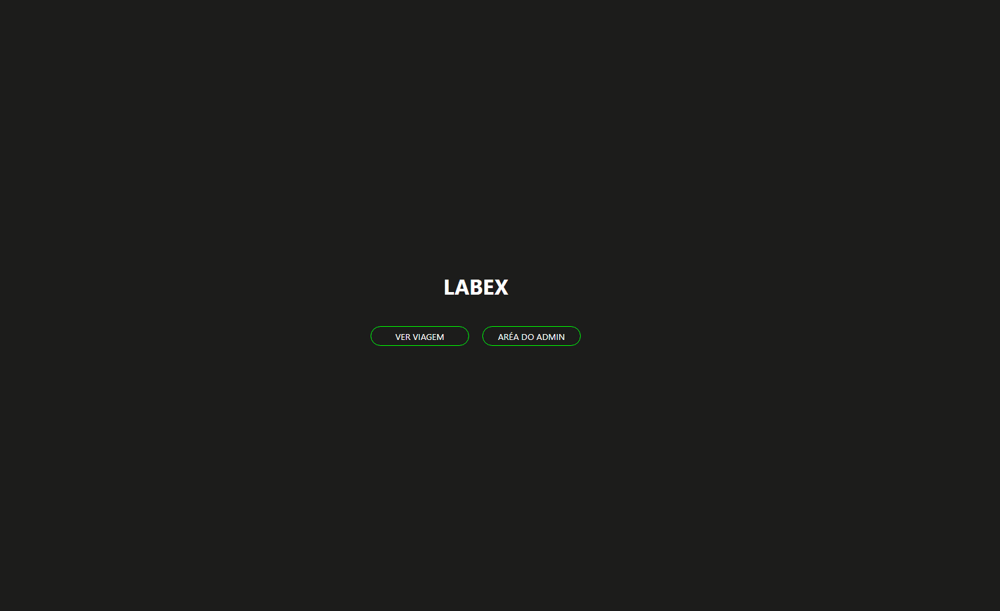
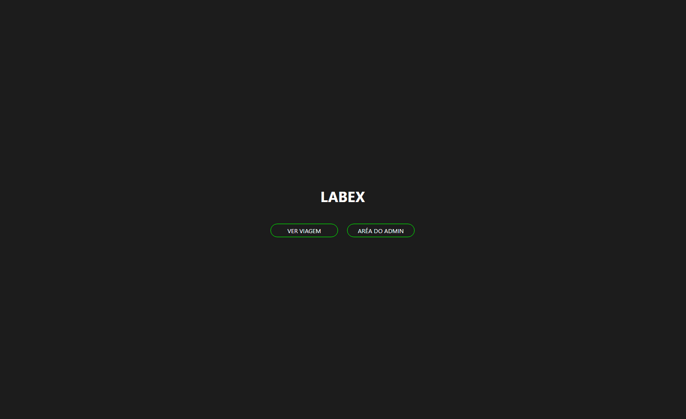

# LABEX

<p align="center">O projeto Labex foi feito para os usuários que querem viajá para outro planeta.</p>
<p align="center">Esse projeto tem a área de inscrição para a viagem e a área de administração (com a provabilidade de criar novas viagens e aceita os candidatos que se inscreveram nas viagens já listadas).</p>

<br>
<hr>

<div align="center">
<h2>Área de viagens</h2>

<h2>Área de administração</h2>

</div>

<br>
<hr>

### Pré-requisitos

<p>Antes de começar, você vai precisar ter instalado em sua máquina as seguintes ferramentas: <a href="https://git-scm.com/downloads">Git</a>, <a href="https://nodejs.org/en/download/">Node.js</a>. <br> Além disto é bom ter um editor para trabalhar com o código como o <a href="https://code.visualstudio.com/">Visual Studio Code</a>.</p>

### Rodando o Projeto
```bash
# Clone o repositório
$ git clone https://github.com/MaritoAmbrosio/projeto-labex.git

# Acessa a pasta do projeto no terminal/cmd
$ cd projeto_labex

# Abra o VSC
$ code .

# Execute o comando para baixar as dependências do projeto
$ npm i

# Exercute o comando para rodar o projeto na sua máquina
$ npm run start

# Email e senha para poder entra na área de administração
email: astrodev@gmail.com.br
senha: 123456
```
<hr>

### Tecnologias
<p>As seguintes ferramentas foram usadas na construção desse projeto.</p>

<ul>
  <li> <a href="https://nodejs.org/en/download/"> Node.js </a> </li>
  <li> <a href="https://pt-br.reactjs.org/"> React </a> </li>
  <li> <a href="https://styled-components.com/"> Styled Components </a> </li>
  <li> <a href="https://code.visualstudio.com/">Visual Studio Code </a> </li>
</ul>

<hr>
<p>Feito por Mario Ambrosio 🖥️<a href="https://www.linkedin.com/in/mario-ambrosio-406353203">Linkedin</a> </p>
